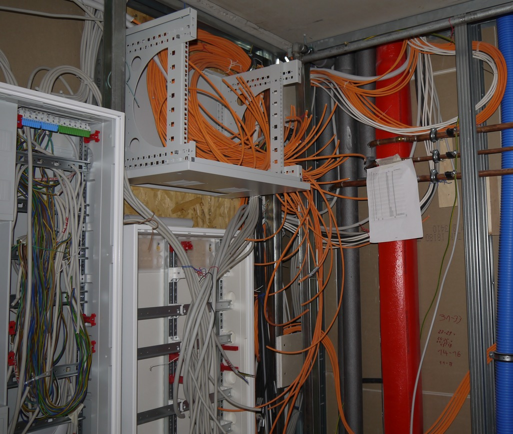
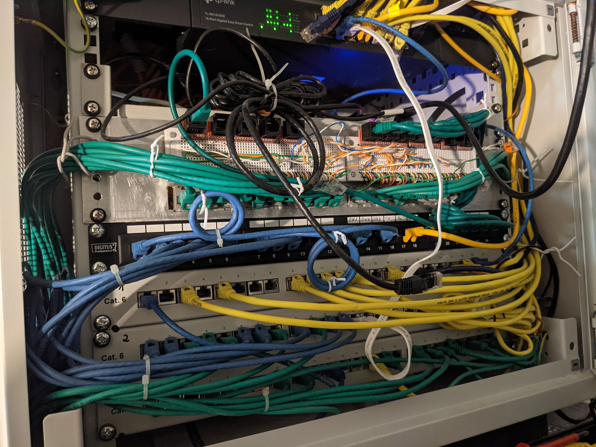
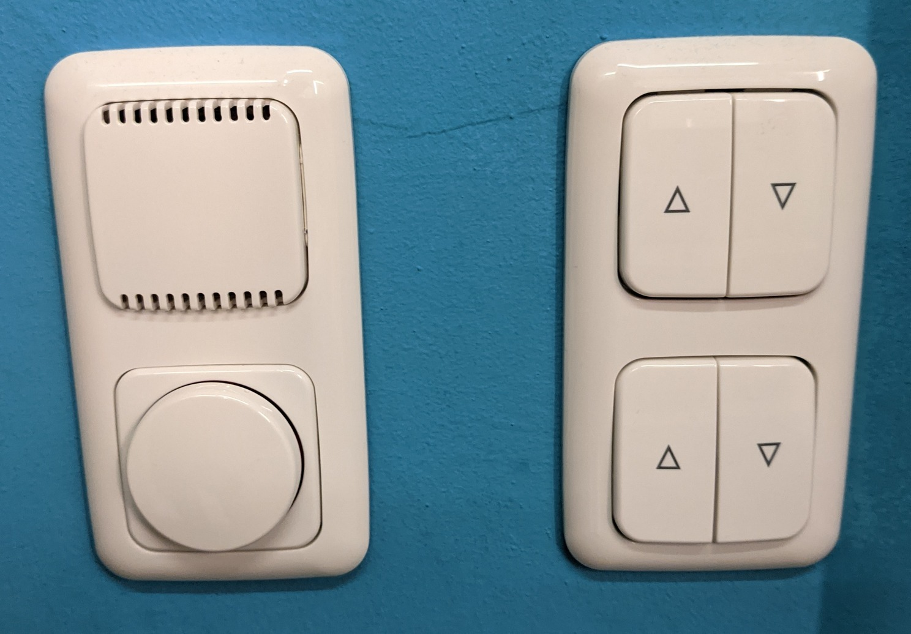
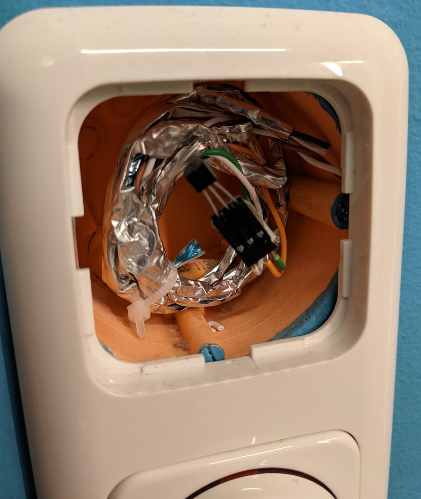
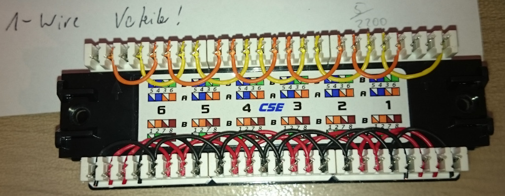
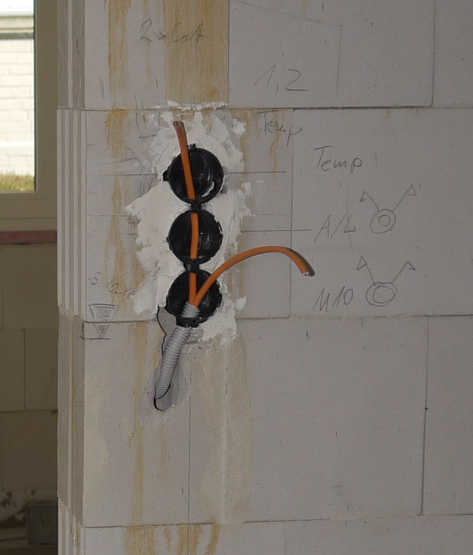

# Hardware

## Zentrale
Alle Sensoren und Aktoren sind sternförmig verkabelt. Entsprechend viele Leitungen müssen organisiert werden. Hierzu steht ein Netzwerkschrank (oben im Bild) zur Verfügung sowie ein Verteilerschrank (rechts unten im Bild).

## Netzwerkschrank
Im Netzwerkschrank sind sämtliche im Haus verlegte CAT.7 Netzwerkkabel gebündelt. Die Kabel sind auf Patch-Panels aufgelegt, wobei nur ein Panel mit Netzwerkkabeln belegt ist. Der Rest sind Signalleitungen für Sensoren und Taster. Dabei beinhaltet ein Netzwerkkabel zwei Signalgruppen á 4 Adern mit der Belegung 1-Wire oder Tastersignale. Beim Auflegen auf die Panels erfolgt bereits eine erste Neuordnung, indem Mischformen von 1-Wire und Tastersignalen bereinigt werden. (Bspw.: Kabel 30 hat auf Gruppe A Tastersignale und auf Gruppe B 1-Wire-Signale. Kabel 34 genau umgekehrt. Entsprechend werden die Gruppen auf zwei Ports gemischt, die anschließend nur 1-Wire-Signale oder nur Tastersignale beinhalten.)

Im oberen Bereich wird ein Breadboard verwendet, um Tastersignale neu zu gruppieren. Bspw. nur noch Licht-Taster- oder nur noch Rollo-Taster-Signale auf einem Neztwerkkabel mit entsprechender Reihenfolge. 

## Verteilerschrank
TODO Momentan noch im Umbau

Zur Organisation der schaltbaren Adern werden WAGO-Klemmen verwendet, siehe Bild.

TODO Auf der rechten Seite befinden sich zunächst 36 24V-Relais (Finder Koppelrelais 38.51.7.024.0050), angesteuert über 5 [mcp23017-Module](hardware/../mcp23017/index.md) für die 18 Fenster-Rollos. Je zwei Relais sind entsprechend gegeneinander verriegelt:

 
*Quelle: https://www.mikrocontroller.net/attachment/298190/Jalusie-Relay-Motor.pdf*

Darunter befindet sich ein Raspberry Pi mit einer Erweiterungsplatine, um die Pins auf Schraubklemm-Anschlüsse zu legen. 

TODO Reihenklemmen für 1-Wire und Level-Shifter

TODO esera-Modul

TODO [DS2408-Modul](hardware/../ds2408/index.md) und [DS2408-Zusatz-Modul](hardware/../ds2408_zusatz/index.md)

TODO: Bild mit Markierungen

## Sensoren
Jeder Raum im Haus ist mit einem Temperatursensor des Typs DS18S20 ausgestattet. Die Sensoren sind jeweils unterputz über den Raumlichtschaltern angebracht, siehe Bild. Ggf. vorhandene Taster sowie die Sensoren teilen sich ein CAT.7 Netzwerkkabel. Die Pinbelegung ist separat dokumentiert. Der Sensor ist mit 3 Adern verbunden, wird also direkt mit Strom versorgt (nicht parasitär)

| Rollo-Taster und Temp.-Sensor  | Temp.-Sensor intern          |
| ------------------------------ | ---------------------------- |
|  |  |

Zusätzlich werden außen und in der Garage Feuchtigkeitssensoren verwendet, welche auf einem emulierten [DS2438 basieren](hardware/../ds2438/index.md).

## Kabelbelegungen
Netzwerkkabel werden Standard TIA-568A folgend aufgelegt.

| PIN | Farbe         | A/B | 1-Wire Belegung   | Taster Belegung |
| --- | ------------- | --- | ----------------- | --------------- |
| 1   | Grün / Weiß   | A   | GND               | Zuleitung (24V) |
| 2   | Grün          | A   | 5V                | A-T1            |
| 3   | Orange / Weiß | A   | 1-Wire rück       | A-T2            |
| 4   | Blau          | B   | 1-Wire zum Sensor | B-T1            |
| 5   | Blau / Weiß   | B   | 1-Wire rück       | B-T2            |
| 6   | Orange        | A   | 1-Wire zum Sensor | A-T3            |
| 7   | Braun / Weiß  | B   | 5V                | B-T3            |
| 8   | Braun         | B   | GND               | Zuleitung (24V) |

Reihenfolge im Panel

| PIN | Farbe         | A/B | 1-Wire Belegung   | Taster Belegung |
| --- | ------------- | --- | ----------------- | --------------- |
| 1   | Grün / Weiß   | A   | GND               | Zuleitung (24V) |
| 2   | Grün          | A   | 5V                | A-T1            |
| 4   | Blau          | B   | 1-Wire zum Sensor | B-T1            |
| 5   | Blau / Weiß   | B   | 1-Wire rück       | B-T2            |
| 3   | Orange / Weiß | A   | 1-Wire rück       | A-T2            |
| 6   | Orange        | A   | 1-Wire zum Sensor | A-T3            |
| 7   | Braun / Weiß  | B   | 5V                | B-T3            |
| 8   | Braun         | B   | GND               | Zuleitung (24V) |

(Pinbelegung)

Tastersignale werden zum Breadboard im Netzwerkschrank weitergeführt und dort weiter sortiert. 1-Wire Signale wiederum werden auf zwei 8er Gruppen eines Patch-Panels geführt. Das Panel wird verwendet, um mehrere Bus-Stränge zu gruppieren.

Im obigen Bild ist dieses Prinzip zu sehen. Auf Port 2-6 werden die Leitungen zu einzelnen Sensoren angeschlossen, wobei diese Leitungen jeweils zwei 1-Wire Anschlüsse (A und B siehe oben) enthalten. Im Bild sind unten die GND und 5V Leitungen aufgeschaltet und oben das 1-Wire Signal A und B. An Port 1 sind durch diese Gruppierung zwei 1-Wire Bus-Leitungen entstanden, die aus jeweils 5 Stern-Strängen bestehen können. (ACHTUNG: Auch wenn hier eine sternförmige Topologie angenommen werden könnte, ist dem nicht so. Der 1-Wire Bus ist letztendlich linear.)

## Beispiel

Wie kommt das Sensor- / Taster-Signal zum Rechner?

Als Beispiel dient das Netzwerkkabel eins und zwei.

| NW-Nr. | Endpunkt | Dose            | Beleg A (1/2)                     | Beleg B (2/2)         |
| ------ | -------- | --------------- | --------------------------------- | --------------------- |
| 1      | Diele    | Temp mit PIR    | 1-Wire, T-Diele                   | 1-Wire Reserve        |
| 2      | Diele    | 2x Doppeltaster | 2 Taster, M10 (Rollo Hoch/Runter) | 2 Taster, A/L (Licht) |

Die NW-Kabel kommen dann an folgendem Panel an:

| NW-Nr. | Belegung | Panel-Nr. | Port-Nr. | Ziel per Verbindungskabel                                    |
| ------ | -------- | --------- | -------- | ------------------------------------------------------------ |
| 1      | A        | 2         | 1        | Breadboard Anschluss 10                                      |
| 1      | B        | 2         | 1        | Breadboard Anschluss 10                                      |
| 2      | A        | 3         | 15       | Port 5 an OW-Gruppe 1 (entspricht Aufschaltung auf OW-Bus 1) |
| 2      | B        | 3         | 15       | Port 5 an OW-Gruppe 1 (entspricht Aufschaltung auf OW-Bus 2) |

In diesem Beispiel sind bereits nur Tastersignale oder nur 1-Wire Signale auf einem NW-Kabel.
Teilweise wird Belegung A und B eines Netzwerkkabels auch gemischt verwendet, um Kabel zu sparen.
Entsprechend werden diese dann beim Auflegen im Patch-Panel bereits vorsortiert. Die 4 Adern eines Kabels werden dann mit 4 Adern eines anderen gemischten Kabels vertauscht, um wieder auf nur 1-Wire oder nur Tastersignale in einem Port zu kommen. Misch-Ports gibt es nicht.

Auf dem Bread-Board werden nun die Verbindungen zu den Relais-Modulen gruppiert. D.h. ein Netzwerkkabel hat dann auf jedem Pin ein Taster-Signal. Im obigen Beispiel landen zwei Licht-Taster im NW-Kabel zum Modul für die Lichtsteuerung und die zwei Rollo-Taster in einem NW-Kabel zur Ansteuerung deines Rollo-Moduls. 