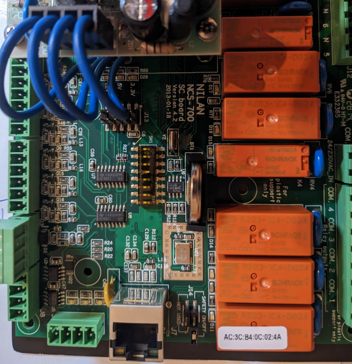

# Zentrale Wohnraumlüftung

Eine zentrale Wohnraumlüftung vom Typ Kermi, x-well N300 - CR300 mit externer Steuereinheit CTS700 soll ebenfalls per Homeassistant automatisiert werden. Es gibt einige Projekte, die sich damit beschäftigen, woraus folgende Idee entstanden ist: Die Lüftung besitzt eine zentrale Steuereinheit mit der Bezeichnung "NILAN NCS-700". Darauf enthalten sind zwei RS485 Anschlüsse, um per modbus zu kommunizieren. Ein Anschluss ist für die externe Steuereinheit vorgesehen und verwendet. Die zweite ist frei. Für eine ähnliche Platine (CTS602) finden sich einige Projekte, wie [dieses von jascdk](https://github.com/jascdk/Nilan_Homeassistant). Mittels eines TTL zu RS485 Converters, [verbunden mit einem ESP](https://esphome.io/components/modbus_controller.html) wird die Modbus Kommunikation implementiert und mittels MQTT an Homeassistant weitergereicht. Leider funktionierte die Kommunikation mit der NCS-700 nicht auf diesem Wege.

Auf der Platine existiert jedoch noch ein Netzwerkanschluss, um eine Verbindung mittels Modbus TCP einzugehen. Hier gibt es bereits [ein Projekt von  Povilas Juzeliūnas](https://github.com/pjuzeliunas/nilan). Für meinen Bedarf jedoch etwas zu umfangreich. Abhilfe schafft die [Modbus Integration von Homeassistant](https://www.home-assistant.io/integrations/modbus/). Die Lüftung wird dazu mit dem Heimnetz verbunden und eine entsprechende IP vergeben (Konfiguration über Steuereinheit). Per YMAL ist jetzt alles eingebunden. Hilfreich war hierzu auch [diese Seite](https://gist.github.com/jakobmoll/d1742736a4027c59e6c1c053fbb27c80) und das [Forum](https://community.home-assistant.io/t/feature-request-for-nilan-ventilation-system-danish-brand/77710/5).

Die Netzwerkschnittstelle ist nicht direkt aus dem Gehäuse der Lüftung herausgeführt. Ein flaches Netzwerkkabel lässt sich jedoch leicht an der unteren Gehäuseseite herausführen.

