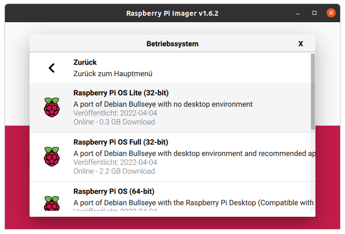

# Software

## Beispiel Einrichtung RaspPi

**System:** Raspbian GNU/Linux 11 (bullseye) 
**Stand:** Dezember 2022

### SD-Karte vorbereiten
Da eine *Headless*-Installation durchgeführt wird, erfolgt die Systeminstallation wie folgt:

* Installation von *Raspberry Pi Imager*
* Passendes Image auswählen (ACHTUNG: wir brauchen keine Desktop Version)
  
* SD-Karte einlegen und mit System bespielen
* SD-Karte mounten
    * boot-Partition: `ssh`-Datei anlegen
    * boot-Partition: `userconf`-Datei anlegen. Inhalt ist `<username>:<pass>`. Das Passwort kann bspw. auf einem Raspbian System wie folgt generiert werden: `echo 'mypassword' | openssl passwd -6 -stdin`<br>
    alternativ, ohne Passwort in bash history: `python3 -c 'import crypt, getpass; print(crypt.crypt(getpass.getpass()))'`
    * root-fs-Partition: Hostname in `/etc/hostname` anpassen

### System aktualisieren
(Achtung kann eine Weile dauern)
```bash
sudo apt-get update
sudo apt-get upgrade
sudo reboot  #bei kernel Aktualisierung
```

### Docker und Docker-Compose installieren
```bash
curl -fsSL https://get.docker.com -o get-docker.sh
sudo sh get-docker.sh
sudo usermod -aG docker lasve
```
**ACHTUNG** Es ist verlockend die *rootless* Variante von *Docker* zu installieren. Leider wird dabei der `network_mode: host` nicht unterstützt. Dieser wiederum ist notwendig für Home Assistant, denn mit einzelnen Port-Weiterleitungen ist es nicht getan. Hier noch ein [Link](https://serverfault.com/questions/1019889/how-to-bind-a-port-in-a-host-network-mode-from-a-container-run-by-a-rootless-d), wo das Problem referenziert ist.


### home-automation einrichten
```bash
ssh-keygen -t ed25519 -C "hwrYYMMDD oder MAILADR"
cat /home/lasve/.ssh/id_ed25519.pub  #SCHLÜSSEL bei Github eintragen

mkdir workspace
cd workspace
sudo apt install git
sudo apt install vim
git clone git@github.com:la-sve/home-automation.git
cd ~
ln -s workspace/home-automation/.pi/.bash_aliases .bash_aliases

vim .bashrc # Nachfolgendes ans Ende schreiben
> export DOCKER_HOST=unix:///run/user/1000/docker.sock
> export PATH=$HOME/.local/bin:$PATH
```

Die Daten von Home Assistant können vom alten Rechner oder Backup bspw. einfach mittels FreeFileSync übernommen werden.

### i2c aktivieren
Prinzipiell nur über `sudo raspi-config` aktivieren. 

### Rollos (Python Service)
Details zur Rolloansteuerung in der Rubrik [i2c](software/../i2c.md). Sowie der [Projektseite](https://github.com/la-sve/home-automation/tree/main/i2cRolloCtrl).

```bash
sudo apt install python3-pip
cd ~/workspace/home-automation/i2cRolloCtrl/
pip3 install -e . --user
cp config/rolloctl.service ../../../.config/systemd/user/
systemctl --user daemon-reload
sudo loginctl enable-linger $USER
systemctl --user enable rolloctl.service
rollo_start
```

### Onewire aktivieren
Zunächst muss w1 als Kernelmodul entsprechend aktiviert und konfiguriert werden. Darauf aufbauend kommt noch das One-Wire File System (owfs) zum Einsatz. Details siehe [OneWire](software/../oneWire.md).

### MQTT Broker 
Wird u.a. für das Einbinden der Tasmota-Steckdosen in HomeAssistant benötigt.

```bash
sudo apt update && sudo apt install -y mosquitto mosquitto-clients
# Passwort und Zugang einrichten -> Daten im ZIM-Wiki!
sudo mosquitto_passwd -c /etc/mosquitto/passwd MY_MQTT_USERNAME
sudo vim /etc/mosquitto/conf.d/default.conf
> listener 1883
> allow_anonymous false
> password_file /etc/mosquitto/passwd
# Als Service aktivieren
sudo systemctl restart mosquitto
sudo systemctl enable mosquitto
# Fehlersuche:
journalctl --unit=mosquitto -f
```

### Homeassistant
Entgegen der Seite [Home Assistant](software/../hass.md) wird hier auf Docker zurückgegriffen, was die Installation und Wartung vereinfachen sollte. 

```bash
cd ~/workspace/home-automation/docker/homeassistant
docker compose up -d   # Kann auch zum Neubauen des Containers genutzt werden
```
Debugging
```bash
# Logs Checken
docker logs homeassistant

# In System einloggen
docker exec -it homeassistant /bin/bash

# neu starten
docker compose restart

# Verbindung testen
curl localhost:8123

# Netzwerkkonfiguration/Verbindungen zeigen (auf host oder in container)
ip addr show
sudo netstat -tulpn

# WLAN und BLUETOOTH deaktivieren
vim /boot/config.txt

   # Additional overlays and parameters are documented /boot/overlays/README
   dtoverlay=disable-wifi
   dtoverlay=disable-bt

# Ausführlicheres Log
journalctl -u docker

# Routing-Tabelle zeigen
sudo iptables-save -c

# Database Integritäts-Check
# https://newbs.rocks/posts/homeassistant-corrupt-sqlite/
sqlite3 home-assistant_v2.db "PRAGMA integrity_check;"
```